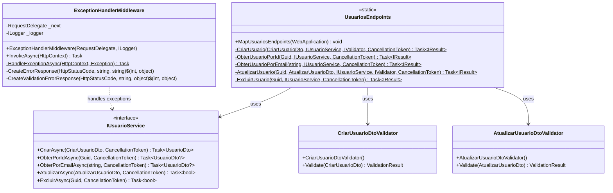

# Emocionario.Api

Camada de apresentação do projeto Emocionario, implementada como API RESTful usando ASP.NET Core Minimal APIs.

## Diagrama de Classe



## Estrutura da API

### Endpoints

#### UsuariosEndpoints
Classe estática que define todos os endpoints HTTP para operações de usuários.

**Localização:** [Endpoints/UsuariosEndpoints.cs](Endpoints/UsuariosEndpoints.cs)

**Rota Base:** `/api/usuarios`

**Endpoints Disponíveis:**

| Método | Rota | Descrição | Status de Sucesso |
|--------|------|-----------|-------------------|
| POST | `/` | Cria um novo usuário | 201 Created |
| GET | `/{id:guid}` | Obtém usuário por ID | 200 OK |
| GET | `/email/{email}` | Obtém usuário por email | 200 OK |
| PUT | `/{id:guid}` | Atualiza dados do usuário | 204 No Content |
| DELETE | `/{id:guid}` | Exclui um usuário | 204 No Content |

#### POST /api/usuarios
**Descrição:** Cria um novo usuário no sistema.

**Request Body:**
```json
{
  "nome": "João",
  "sobrenome": "Silva",
  "email": "joao.silva@exemplo.com",
  "dataNascimento": "2000-01-15"
}
```

**Responses:**
- `201 Created`: Usuário criado com sucesso
- `400 Bad Request`: Dados de entrada inválidos
- `409 Conflict`: Email já cadastrado
- `422 Unprocessable Entity`: Erro de validação

#### GET /api/usuarios/{id}
**Descrição:** Obtém um usuário pelo identificador único.

**Path Parameters:**
- `id` (Guid): Identificador do usuário

**Responses:**
- `200 OK`: Usuário encontrado
- `404 Not Found`: Usuário não encontrado

#### GET /api/usuarios/email/{email}
**Descrição:** Obtém um usuário pelo endereço de email.

**Path Parameters:**
- `email` (string): Email do usuário

**Responses:**
- `200 OK`: Usuário encontrado
- `400 Bad Request`: Email inválido ou vazio
- `404 Not Found`: Usuário não encontrado

#### PUT /api/usuarios/{id}
**Descrição:** Atualiza os dados de um usuário existente. Suporta atualização parcial.

**Path Parameters:**
- `id` (Guid): Identificador do usuário

**Request Body:**
```json
{
  "id": "3fa85f64-5717-4562-b3fc-2c963f66afa6",
  "nome": "João",
  "sobrenome": "Silva Santos",
  "dataNascimento": "2000-01-15"
}
```

**Responses:**
- `204 No Content`: Usuário atualizado com sucesso
- `400 Bad Request`: ID incompatível ou dados inválidos
- `404 Not Found`: Usuário não encontrado
- `422 Unprocessable Entity`: Erro de validação

#### DELETE /api/usuarios/{id}
**Descrição:** Exclui um usuário do sistema.

**Path Parameters:**
- `id` (Guid): Identificador do usuário

**Responses:**
- `204 No Content`: Usuário excluído com sucesso
- `404 Not Found`: Usuário não encontrado

### Validators

#### CriarUsuarioDtoValidator
**Localização:** [Validators/CriarUsuarioDtoValidator.cs](Validators/CriarUsuarioDtoValidator.cs)

Validador para o DTO de criação de usuário usando FluentValidation.

**Regras de Validação:**

| Campo | Regras | Mensagem de Erro |
|-------|--------|------------------|
| Nome | Obrigatório | "O nome é obrigatório." |
| | 3-50 caracteres | "O nome deve ter entre 3 e 50 caracteres." |
| | Apenas letras | "O nome deve conter apenas letras." |
| Sobrenome | Obrigatório | "O sobrenome é obrigatório." |
| | 3-50 caracteres | "O sobrenome deve ter entre 3 e 50 caracteres." |
| | Apenas letras | "O sobrenome deve conter apenas letras." |
| Email | Obrigatório | "O email é obrigatório." |
| | Formato válido | "O email deve ser um endereço válido." |
| | Máximo 255 caracteres | "O email não pode exceder 255 caracteres." |
| DataNascimento | Não pode ser futura | "A data de nascimento não pode ser uma data futura." |

#### AtualizarUsuarioDtoValidator
**Localização:** [Validators/AtualizarUsuarioDtoValidator.cs](Validators/AtualizarUsuarioDtoValidator.cs)

Validador para o DTO de atualização de usuário usando FluentValidation.

**Regras de Validação:**

| Campo | Regras | Mensagem de Erro |
|-------|--------|------------------|
| Id | Obrigatório | "O ID é obrigatório." |
| Nome | 3-50 caracteres (quando fornecido) | "O nome deve ter entre 3 e 50 caracteres." |
| | Apenas letras | "O nome deve conter apenas letras." |
| Sobrenome | 3-50 caracteres (quando fornecido) | "O sobrenome deve ter entre 3 e 50 caracteres." |
| | Apenas letras | "O sobrenome deve conter apenas letras." |
| DataNascimento | Não pode ser futura (quando fornecido) | "A data de nascimento não pode ser uma data futura." |

### Middleware

#### ExceptionHandlerMiddleware
**Localização:** [Middleware/ExceptionHandlerMiddleware.cs](Middleware/ExceptionHandlerMiddleware.cs)

Middleware global para captura e tratamento de exceções não tratadas.

**Responsabilidades:**
- Capturar todas as exceções não tratadas
- Registrar exceções no log
- Converter exceções em respostas HTTP apropriadas
- Padronizar formato de erro (Problem Details RFC 7807)

**Mapeamento de Exceções:**

| Exceção | Status HTTP | Título |
|---------|-------------|--------|
| ArgumentException | 400 Bad Request | "Argumento inválido" |
| ValidationException | 400 Bad Request | "Erro de validação" |
| KeyNotFoundException | 404 Not Found | "Recurso não encontrado" |
| InvalidOperationException | 409 Conflict | "Operação inválida" |
| Exception (outras) | 500 Internal Server Error | "Erro interno do servidor" |

**Formato de Resposta de Erro:**
```json
{
  "tipo": "https://tools.ietf.org/html/rfc7231#section-6.5.1",
  "titulo": "Argumento inválido",
  "status": 400,
  "detalhe": "Descrição detalhada do erro",
  "dataHora": "2024-01-15T10:30:00Z"
}
```

**Formato de Resposta de Validação:**
```json
{
  "tipo": "https://tools.ietf.org/html/rfc7231#section-6.5.1",
  "titulo": "Erro de validação",
  "status": 400,
  "erros": [
    {
      "campo": "Nome",
      "erro": "O nome é obrigatório."
    }
  ],
  "dataHora": "2024-01-15T10:30:00Z"
}
```

### Configuração (Program.cs)

**Localização:** [Program.cs](Program.cs)

**Serviços Configurados:**
- **OpenAPI/Swagger:** Documentação da API com Scalar UI
- **FluentValidation:** Validação de DTOs
- **CORS:** Política permissiva para desenvolvimento
- **Infraestrutura:** DbContext e repositórios
- **Services:** Serviços de aplicação

**Middlewares:**
1. ExceptionHandlerMiddleware (primeiro na pipeline)
2. HTTPS Redirection
3. CORS
4. Endpoints

**Endpoints Adicionais:**
- `GET /status`: Verifica status e versão da API

## Tabela de Testes

### Testes de Endpoints

| Endpoint | Cenário de Teste | Entrada | Resultado Esperado | Prioridade |
|----------|------------------|---------|-------------------|------------|
| **POST /api/usuarios** | | | | |
| | Criar com dados válidos | CriarUsuarioDto válido | 201 Created com Location header | Alta |
| | Criar com email duplicado | Email já existente | 409 Conflict | Alta |
| | Criar sem nome | Nome vazio | 422 Validation Problem | Alta |
| | Criar sem sobrenome | Sobrenome vazio | 422 Validation Problem | Alta |
| | Criar sem email | Email vazio | 422 Validation Problem | Alta |
| | Criar com email inválido | Email sem @ | 422 Validation Problem | Alta |
| | Criar com nome curto | Nome com 2 caracteres | 422 Validation Problem | Média |
| | Criar com nome longo | Nome com 51 caracteres | 422 Validation Problem | Média |
| | Criar com data futura | DataNascimento no futuro | 422 Validation Problem | Alta |
| | Criar sem data nascimento | DataNascimento null | 201 Created | Média |
| | Verificar Location header | Criar usuário | Header contém /api/usuarios/{id} | Média |
| **GET /api/usuarios/{id}** | | | | |
| | Obter usuário existente | Id válido existente | 200 OK com UsuarioDto | Alta |
| | Obter usuário inexistente | Id válido não existente | 404 Not Found | Alta |
| | Obter com Id inválido | Id não-guid | 400 Bad Request | Média |
| | Verificar formato resposta | Id válido | JSON com todas propriedades | Média |
| **GET /api/usuarios/email/{email}** | | | | |
| | Obter por email existente | Email válido existente | 200 OK com UsuarioDto | Alta |
| | Obter por email inexistente | Email válido não existente | 404 Not Found | Alta |
| | Obter com email vazio | Email vazio | 400 Bad Request | Alta |
| | Obter com email em branco | Espaços em branco | 400 Bad Request | Média |
| **PUT /api/usuarios/{id}** | | | | |
| | Atualizar com dados válidos | Dto completo válido | 204 No Content | Alta |
| | Atualizar apenas nome | Apenas Nome preenchido | 204 No Content | Alta |
| | Atualizar apenas sobrenome | Apenas Sobrenome preenchido | 204 No Content | Alta |
| | Atualizar parcialmente | Nome e Sobrenome | 204 No Content | Alta |
| | Atualizar usuário inexistente | Id não existente | 404 Not Found | Alta |
| | Atualizar com Id incompatível | Id rota ≠ Id body | 400 Bad Request | Alta |
| | Atualizar com nome inválido | Nome vazio | 422 Validation Problem | Média |
| | Atualizar com sobrenome inválido | Sobrenome vazio | 422 Validation Problem | Média |
| | Atualizar com data futura | DataNascimento futura | 422 Validation Problem | Média |
| **DELETE /api/usuarios/{id}** | | | | |
| | Excluir usuário existente | Id válido existente | 204 No Content | Alta |
| | Excluir usuário inexistente | Id válido não existente | 404 Not Found | Alta |
| | Excluir com Id inválido | Id não-guid | 400 Bad Request | Média |
| **GET /status** | | | | |
| | Verificar status da API | Sem parâmetros | 200 OK com informações | Baixa |

### Testes de Validators

| Validator | Cenário de Teste | Entrada | Resultado Esperado | Prioridade |
|-----------|------------------|---------|-------------------|------------|
| **CriarUsuarioDtoValidator** | | | | |
| | Validar dados completos válidos | Todos campos válidos | IsValid = true | Alta |
| | Nome vazio | Nome = "" | IsValid = false, erro no Nome | Alta |
| | Nome muito curto | Nome = "Jo" | IsValid = false, erro no Nome | Média |
| | Nome muito longo | Nome com 51 caracteres | IsValid = false, erro no Nome | Média |
| | Nome com números | Nome = "João123" | IsValid = false, erro no Nome | Média |
| | Sobrenome vazio | Sobrenome = "" | IsValid = false, erro no Sobrenome | Alta |
| | Sobrenome muito curto | Sobrenome = "Si" | IsValid = false, erro no Sobrenome | Média |
| | Sobrenome muito longo | Sobrenome com 51 caracteres | IsValid = false, erro no Sobrenome | Média |
| | Email vazio | Email = "" | IsValid = false, erro no Email | Alta |
| | Email sem @ | Email = "teste.com" | IsValid = false, erro no Email | Alta |
| | Email inválido | Email sem domínio | IsValid = false, erro no Email | Alta |
| | Email muito longo | Email com 256 caracteres | IsValid = false, erro no Email | Média |
| | Data nascimento futura | Data no futuro | IsValid = false, erro em DataNascimento | Alta |
| | Data nascimento nula | DataNascimento = null | IsValid = true | Média |
| | Múltiplos erros | Vários campos inválidos | IsValid = false, múltiplos erros | Alta |
| **AtualizarUsuarioDtoValidator** | | | | |
| | Validar dados completos válidos | Todos campos válidos | IsValid = true | Alta |
| | Id vazio | Id = Guid.Empty | IsValid = false, erro no Id | Alta |
| | Nome vazio quando fornecido | Nome = "" | IsValid = false, erro no Nome | Média |
| | Nome não fornecido | Nome = null | IsValid = true (campo opcional) | Média |
| | Sobrenome vazio quando fornecido | Sobrenome = "" | IsValid = false, erro no Sobrenome | Média |
| | Sobrenome não fornecido | Sobrenome = null | IsValid = true (campo opcional) | Média |
| | Data futura quando fornecida | Data no futuro | IsValid = false, erro em DataNascimento | Média |
| | Data não fornecida | DataNascimento = null | IsValid = true (campo opcional) | Média |

### Testes de Middleware

| Cenário de Teste | Exceção Lançada | Resultado Esperado | Prioridade |
|------------------|-----------------|-------------------|------------|
| ArgumentException capturada | ArgumentException("Valor inválido") | 400 Bad Request, JSON formatado | Alta |
| ValidationException capturada | ValidationException com erros | 400 Bad Request, array de erros | Alta |
| KeyNotFoundException capturada | KeyNotFoundException("Não encontrado") | 404 Not Found, JSON formatado | Alta |
| InvalidOperationException capturada | InvalidOperationException("Conflito") | 409 Conflict, JSON formatado | Alta |
| Exceção genérica capturada | Exception("Erro inesperado") | 500 Internal Server Error | Alta |
| Logging de exceção | Qualquer exceção | Log registrado com detalhes | Média |
| Content-Type da resposta | Qualquer exceção | application/json | Média |
| Formato Problem Details | Qualquer exceção | Tipo, Titulo, Status, Detalhe presentes | Alta |
| Data/hora do erro | Qualquer exceção | DataHora próximo ao DateTime.UtcNow | Baixa |
| Pipeline continua sem erro | Nenhuma exceção | Next() executado normalmente | Média |

### Testes de Integração

| Cenário de Teste | Descrição | Resultado Esperado | Prioridade |
|------------------|-----------|-------------------|------------|
| CRUD completo via API | POST → GET → PUT → DELETE | Todas operações HTTP bem-sucedidas | Alta |
| Validação end-to-end | POST com dados inválidos | 422 com detalhes de validação | Alta |
| OpenAPI Schema | Acessar /openapi/v1.json | Schema JSON válido retornado | Média |
| Scalar UI | Acessar /scalar/v1 em dev | Interface de documentação carregada | Média |
| CORS headers | Request com Origin header | Headers CORS presentes na resposta | Média |
| HTTPS redirection | Request HTTP em produção | Redirect 307 para HTTPS | Média |
| Status endpoint | GET /status | JSON com Status, Aplicacao, Versao | Baixa |
| Content negotiation | Accept: application/json | Response em JSON | Média |
| CancellationToken propagado | Cancelar request | OperationCanceledException | Baixa |
| Location header em POST | Criar usuário | Location: /api/usuarios/{guid} | Alta |

## Princípios de Design Aplicados

### RESTful API Design
- **Recursos:** URLs representam recursos (`/api/usuarios`)
- **Métodos HTTP:** GET (consulta), POST (criação), PUT (atualização), DELETE (exclusão)
- **Status Codes:** Uso semântico apropriado (200, 201, 204, 400, 404, 409, 422, 500)
- **Stateless:** Cada requisição contém todas informações necessárias
- **Hypermedia:** Location headers para recursos criados

### Clean Architecture
- **Presentation Layer:** Endpoints e validação de entrada
- **Separação de Camadas:** API não depende de detalhes de infraestrutura
- **Dependency Inversion:** Depende de abstrações (IUsuarioService)
- **DTOs:** Isolamento entre API e camadas internas

### SOLID
- **Single Responsibility:**
  - Endpoints apenas roteiam requisições
  - Validators apenas validam entrada
  - Middleware apenas trata exceções
- **Open/Closed:** Extensível via novos endpoints sem modificar existentes
- **Dependency Inversion:** Injeção de dependências via container IoC

### Outros Padrões
- **Minimal APIs:** Sintaxe concisa e funcional
- **Endpoint Grouping:** Agrupamento lógico de rotas relacionadas
- **Validation Pipeline:** FluentValidation antes da lógica de negócio
- **Global Exception Handling:** Middleware centralizado
- **Problem Details (RFC 7807):** Formato padronizado de erros
- **API Documentation:** OpenAPI 3.0 com Scalar UI
- **Fail-Fast:** Validações na entrada antes de processar

## Convenções de Código

- **Namespace:** `Emocionario.Api.{Subpasta}`
- **Endpoints:** Classes estáticas com métodos privados de handler
- **Validators:** Herdam de `AbstractValidator<T>` do FluentValidation
- **Rotas:** Kebab-case e versionamento via prefixo `/api`
- **HTTP Methods:** Uso semântico apropriado
- **Status Codes:** Status mais específico possível
- **Async/Await:** Todos handlers são assíncronos
- **CancellationToken:** Propagado em todas operações
- **XML Comments:** Documentação em todos membros públicos
- **OpenAPI Attributes:** `WithName()`, `WithSummary()`, `WithTags()`

## Configuração e Execução

### Dependências
- ASP.NET Core 9.0
- FluentValidation.AspNetCore
- Scalar.AspNetCore (documentação)
- Entity Framework Core (via Infrastructure)

### Variáveis de Ambiente
- `ASPNETCORE_ENVIRONMENT`: Define o ambiente (Development, Production)
- Connection strings configuradas em appsettings.json

### Executar a API
```bash
dotnet run --project src/Emocionario.Api
```

### Acessar Documentação
- **OpenAPI JSON:** `https://localhost:5001/openapi/v1.json`
- **Scalar UI:** `https://localhost:5001/scalar/v1` (apenas em Development)

## Boas Práticas Implementadas

1. **Validação em Múltiplas Camadas:**
   - FluentValidation na API
   - Value Objects no Domain

2. **Tratamento de Erros:**
   - Middleware global
   - Respostas padronizadas
   - Logging estruturado

3. **Segurança:**
   - HTTPS enforcement
   - CORS configurável
   - Validação rigorosa de entrada

4. **Documentação:**
   - OpenAPI 3.0
   - XML comments
   - Interface interativa (Scalar)

5. **Performance:**
   - Operações assíncronas
   - CancellationToken support
   - Minimal APIs (overhead reduzido)

6. **Manutenibilidade:**
   - Separação clara de responsabilidades
   - Código autodocumentado
   - Testes abrangentes
