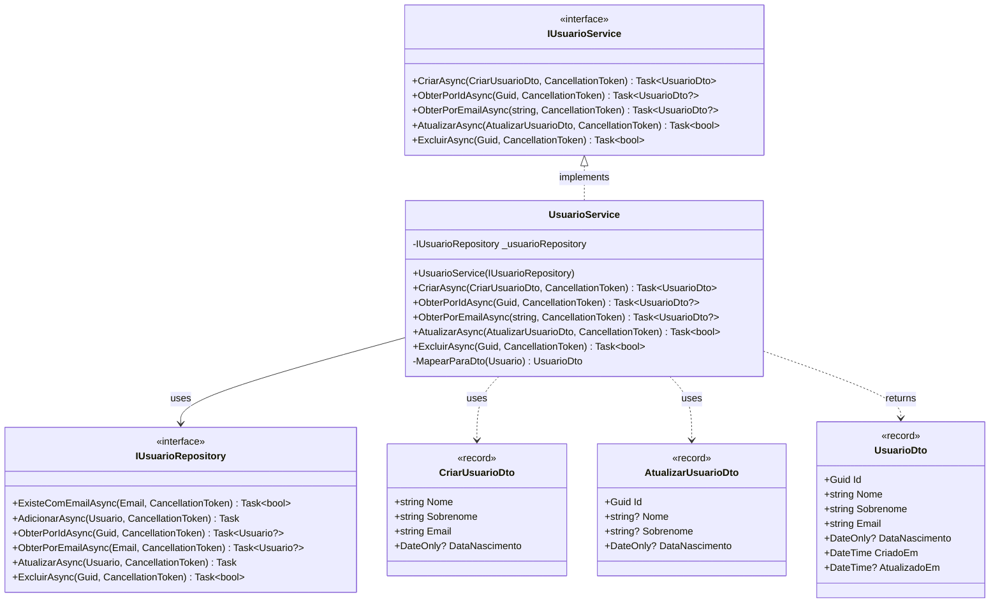

# Emocionario.Application

Camada de aplicação do projeto Emocionario, responsável por orquestrar a lógica de negócios e coordenar as operações entre a camada de domínio e infraestrutura.

## Diagrama de Classe

## Estrutura da Aplicação

### Services

#### IUsuarioService
Interface que define o contrato de serviços para operações de usuário.

**Localização:** [IUsuarioService.cs](Services/IUsuarioService.cs)

**Operações:**
- `CriarAsync()`: Cria um novo usuário no sistema
- `ObterPorIdAsync()`: Obtém um usuário por Id
- `ObterPorEmailAsync()`: Obtém um usuário por Email
- `AtualizarAsync()`: Atualiza dados de um usuário existente
- `ExcluirAsync()`: Exclui um usuário do sistema

#### UsuarioService
Implementação concreta do serviço de usuário.

**Localização:** [UsuarioService.cs](Services/UsuarioService.cs)

**Responsabilidades:**
- Validar duplicidade de email antes da criação
- Converter DTOs em entidades de domínio
- Orquestrar operações entre camada de domínio e repositório
- Mapear entidades de domínio para DTOs de resposta
- Gerenciar atualizações parciais de dados

**Dependências:**
- `IUsuarioRepository`: Para persistência de dados

### Repositories

#### IUsuarioRepository
Interface que define o contrato de acesso a dados para usuários.

**Localização:** [Repositories/IUsuarioRepository.cs](Repositories/IUsuarioRepository.cs)

**Operações:**
- `ExisteComEmailAsync()`: Verifica se já existe usuário com email
- `AdicionarAsync()`: Adiciona novo usuário
- `ObterPorIdAsync()`: Obtém usuário por Id
- `ObterPorEmailAsync()`: Obtém usuário por Email
- `AtualizarAsync()`: Atualiza usuário existente
- `ExcluirAsync()`: Exclui usuário

### DTOs (Data Transfer Objects)

#### UsuarioDto
**Localização:** [DTOs/UsuarioDto.cs](DTOs/UsuarioDto.cs)

DTO de resposta contendo os dados completos do usuário.

**Propriedades:**
- `Id` (Guid): Identificador único
- `Nome` (string): Primeiro nome do usuário
- `Sobrenome` (string): Sobrenome do usuário
- `Email` (string): Email do usuário
- `DataNascimento` (DateOnly?): Data de nascimento
- `CriadoEm` (DateTime): Data de criação do registro
- `AtualizadoEm` (DateTime?): Data da última atualização

#### CriarUsuarioDto
**Localização:** [DTOs/CriarUsuarioDto.cs](DTOs/CriarUsuarioDto.cs)

DTO de entrada para criação de usuário.

**Propriedades:**
- `Nome` (string): Primeiro nome do usuário
- `Sobrenome` (string): Sobrenome do usuário
- `Email` (string): Email do usuário
- `DataNascimento` (DateOnly?): Data de nascimento (opcional)

#### AtualizarUsuarioDto
**Localização:** [DTOs/AtualizarUsuarioDto.cs](DTOs/AtualizarUsuarioDto.cs)

DTO de entrada para atualização de usuário. Todos os campos, exceto Id, são opcionais para permitir atualizações parciais.

**Propriedades:**
- `Id` (Guid): Identificador do usuário a ser atualizado
- `Nome` (string?): Primeiro nome do usuário (opcional)
- `Sobrenome` (string?): Sobrenome do usuário (opcional)
- `DataNascimento` (DateOnly?): Data de nascimento (opcional)

## Tabela de Testes

### Testes de Service

| Cenário de Teste | Entrada | Resultado Esperado | Prioridade |
|------------------|---------|-------------------|------------|
| **CriarAsync** | | | |
| Criar usuário com dados válidos | CriarUsuarioDto válido | UsuarioDto retornado com Id gerado | Alta |
| Criar com email já cadastrado | Email existente | InvalidOperationException | Alta |
| Criar sem data de nascimento | DataNascimento = null | Usuário criado com DataNascimento null | Média |
| Criar com nome inválido | Nome vazio ou curto | ArgumentException | Alta |
| Criar com sobrenome inválido | Sobrenome vazio ou curto | ArgumentException | Alta |
| Criar com email inválido | Email sem @ ou sem ponto | ArgumentException | Alta |
| Criar com data de nascimento futura | Data no futuro | ArgumentException | Alta |
| Verificar chamada ao repositório | Dados válidos | AdicionarAsync chamado uma vez | Média |
| **ObterPorIdAsync** | | | |
| Obter usuário existente | Id válido existente | UsuarioDto retornado | Alta |
| Obter usuário inexistente | Id válido não existente | null retornado | Alta |
| Obter com Id vazio | Guid.Empty | null retornado | Média |
| **ObterPorEmailAsync** | | | |
| Obter usuário por email existente | Email válido existente | UsuarioDto retornado | Alta |
| Obter usuário por email inexistente | Email válido não existente | null retornado | Alta |
| Obter com email inválido | Email sem @ | ArgumentException | Média |
| **AtualizarAsync** | | | |
| Atualizar todos os campos | Dto com todos campos preenchidos | true retornado | Alta |
| Atualizar apenas nome | Dto com apenas Nome | true, apenas Nome atualizado | Alta |
| Atualizar apenas sobrenome | Dto com apenas Sobrenome | true, apenas Sobrenome atualizado | Alta |
| Atualizar apenas data nascimento | Dto com apenas DataNascimento | true, apenas DataNascimento atualizado | Média |
| Atualizar campos parcialmente | Nome e Sobrenome preenchidos | true, campos especificados atualizados | Alta |
| Atualizar usuário inexistente | Id não existente | false retornado | Alta |
| Atualizar com nome inválido | Nome vazio | ArgumentException | Média |
| Atualizar com sobrenome inválido | Sobrenome vazio | ArgumentException | Média |
| Atualizar com data futura | Data no futuro | ArgumentException | Média |
| Verificar que email não é alterado | Atualização válida | Email permanece inalterado | Alta |
| **ExcluirAsync** | | | |
| Excluir usuário existente | Id válido existente | true retornado | Alta |
| Excluir usuário inexistente | Id válido não existente | false retornado | Alta |
| Verificar chamada ao repositório | Id válido | ExcluirAsync chamado uma vez | Média |

### Testes de Repository (Interface)

| Cenário de Teste | Descrição | Resultado Esperado | Prioridade |
|------------------|-----------|-------------------|------------|
| **ExisteComEmailAsync** | | | |
| Email existente | Email já cadastrado | true retornado | Alta |
| Email não existente | Email não cadastrado | false retornado | Alta |
| **AdicionarAsync** | | | |
| Adicionar novo usuário | Usuario válido | Usuário persistido | Alta |
| **ObterPorIdAsync** | | | |
| Buscar por Id existente | Id válido existente | Usuario retornado | Alta |
| Buscar por Id inexistente | Id válido não existente | null retornado | Alta |
| **ObterPorEmailAsync** | | | |
| Buscar por Email existente | Email válido existente | Usuario retornado | Alta |
| Buscar por Email inexistente | Email válido não existente | null retornado | Alta |
| **AtualizarAsync** | | | |
| Atualizar usuário existente | Usuario modificado | Alterações persistidas | Alta |
| **ExcluirAsync** | | | |
| Excluir usuário existente | Id válido existente | true retornado | Alta |
| Excluir usuário inexistente | Id válido não existente | false retornado | Alta |

### Testes de Integração

| Cenário de Teste | Descrição | Resultado Esperado | Prioridade |
|------------------|-----------|-------------------|------------|
| Ciclo completo CRUD | Criar → Obter → Atualizar → Excluir | Todas operações bem-sucedidas | Alta |
| Validação de unicidade de email | Criar dois usuários com mesmo email | Segundo lança InvalidOperationException | Alta |
| Mapeamento DTO → Entity → DTO | Criar e obter usuário | Dados consistentes em ida e volta | Alta |
| Atualização parcial mantém dados | Atualizar apenas nome | Outros campos permanecem inalterados | Média |
| Cancelamento de operações | CancellationToken cancelado | OperationCanceledException | Baixa |

## Princípios de Design Aplicados

### Clean Architecture
- **Application Layer:** Contém casos de uso e lógica de aplicação
- **DTOs:** Isolam a camada de apresentação do domínio
- **Abstrações:** Interfaces de repositório invertendo dependências
- **Independência de Frameworks:** Não depende de detalhes de infraestrutura

### SOLID
- **Single Responsibility:** Cada serviço tem responsabilidade única
- **Open/Closed:** DTOs são records imutáveis
- **Liskov Substitution:** Implementações de interfaces são intercambiáveis
- **Interface Segregation:** Interfaces focadas e coesas
- **Dependency Inversion:** Depende de abstrações (IUsuarioRepository)

### Outros Padrões
- **Repository Pattern:** Abstração de acesso a dados
- **Service Layer Pattern:** Encapsula lógica de negócios
- **DTO Pattern:** Transferência de dados entre camadas
- **Fail-Fast:** Validações antecipadas (email duplicado)
- **Async/Await:** Operações assíncronas para melhor performance
- **CancellationToken:** Suporte a cancelamento de operações

## Regras de Negócio

### Criação de Usuário
1. Email deve ser único no sistema
2. Todos os campos obrigatórios devem ser fornecidos (exceto DataNascimento)
3. Validações de Value Objects são aplicadas automaticamente

### Atualização de Usuário
1. Usuário deve existir
2. Email não pode ser alterado
3. Campos não fornecidos mantêm valores originais (atualização parcial)
4. Validações de Value Objects são aplicadas aos campos alterados

### Exclusão de Usuário
1. Retorna false se usuário não existe
2. Retorna true se exclusão for bem-sucedida

## Convenções de Código

- **Namespace:** `Emocionario.Application.{Agregado}.{Subpasta}`
- **DTOs:** Implementados como `sealed record` para imutabilidade
- **Services:** Classes `sealed` com injeção de dependência via construtor
- **Async/Await:** Todos métodos de I/O são assíncronos
- **CancellationToken:** Suportado em todas operações assíncronas com valor padrão
- **Nullable Reference Types:** Habilitados para maior segurança de tipos
- **Mapeamento:** Método privado estático `MapearParaDto()` no serviço
