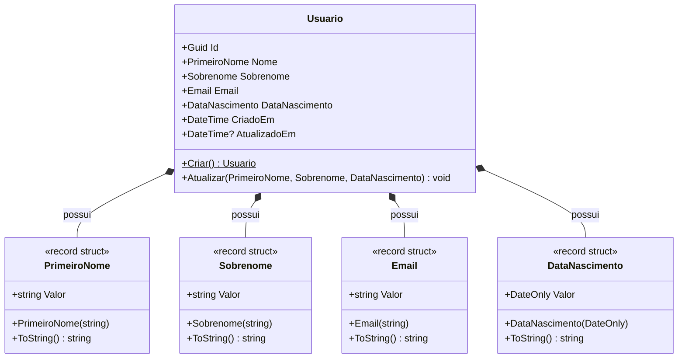

# Emocionario.Domain

Camada de domínio do projeto Emocionario, implementada seguindo os princípios de Domain-Driven Design (DDD).

## Diagrama de Classe

## Estrutura do Domínio

### Entidades

#### Usuario
Entidade principal que representa um usuário do sistema.

**Localização:** [Usuario.cs](Usuarios/Usuario.cs)

**Propriedades:**
- `Id` (Guid): Identificador único
- `Nome` (PrimeiroNome): Primeiro nome do usuário
- `Sobrenome` (Sobrenome): Sobrenome do usuário
- `Email` (Email): Email do usuário
- `DataNascimento` (DataNascimento): Data de nascimento
- `CriadoEm` (DateTime): Data de criação do registro
- `AtualizadoEm` (DateTime?): Data da última atualização

**Métodos:**
- `Criar()`: Factory method para criação de novo usuário
- `Atualizar()`: Atualiza dados do usuário (exceto email)

### Value Objects

#### PrimeiroNome
**Localização:** [PrimeiroNome.cs](Usuarios/ValueObjects/PrimeiroNome.cs)

**Regras de Validação:**
- Não pode estar vazio
- Mínimo de 3 caracteres
- Máximo de 50 caracteres

#### Sobrenome
**Localização:** [Sobrenome.cs](Usuarios/ValueObjects/Sobrenome.cs)

**Regras de Validação:**
- Não pode estar vazio
- Mínimo de 3 caracteres
- Máximo de 50 caracteres

#### Email
**Localização:** [Email.cs](Usuarios/ValueObjects/Email.cs)

**Regras de Validação:**
- Não pode estar vazio
- Deve conter "@"
- Deve conter "."

#### DataNascimento
**Localização:** [DataNascimento.cs](Usuarios/ValueObjects/DataNascimento.cs)

**Regras de Validação:**
- Não pode ser uma data futura

## Tabela de Testes

### Testes de Value Objects

| Value Object | Cenário de Teste | Entrada | Resultado Esperado | Prioridade |
|--------------|------------------|---------|-------------------|------------|
| **PrimeiroNome** | Criação com valor válido | "João" | Sucesso | Alta |
| | Valor vazio | "" | ArgumentException | Alta |
| | Valor null | null | ArgumentException | Alta |
| | Valor com espaços em branco | "   " | ArgumentException | Alta |
| | Valor com 2 caracteres | "Jo" | ArgumentException | Média |
| | Valor com 3 caracteres (mínimo) | "Ana" | Sucesso | Média |
| | Valor com 50 caracteres (máximo) | "A" * 50 | Sucesso | Média |
| | Valor com 51 caracteres | "A" * 51 | ArgumentException | Média |
| | Conversão implícita para string | PrimeiroNome("João") | "João" | Baixa |
| **Sobrenome** | Criação com valor válido | "Silva" | Sucesso | Alta |
| | Valor vazio | "" | ArgumentException | Alta |
| | Valor null | null | ArgumentException | Alta |
| | Valor com espaços em branco | "   " | ArgumentException | Alta |
| | Valor com 2 caracteres | "Si" | ArgumentException | Média |
| | Valor com 3 caracteres (mínimo) | "Sá" | Sucesso | Média |
| | Valor com 50 caracteres (máximo) | "A" * 50 | Sucesso | Média |
| | Valor com 51 caracteres | "A" * 51 | ArgumentException | Média |
| | Conversão implícita para string | Sobrenome("Silva") | "Silva" | Baixa |
| **Email** | Criação com email válido | "usuario@exemplo.com" | Sucesso | Alta |
| | Valor vazio | "" | ArgumentException | Alta |
| | Valor null | null | ArgumentException | Alta |
| | Valor com espaços em branco | "   " | ArgumentException | Alta |
| | Email sem @ | "usuario.exemplo.com" | ArgumentException | Alta |
| | Email sem domínio | "usuario@" | ArgumentException | Alta |
| | Email sem ponto | "usuario@exemplo" | ArgumentException | Alta |
| | Email com formato válido mínimo | "a@b.c" | Sucesso | Média |
| | Conversão implícita para string | Email("teste@test.com") | "teste@test.com" | Baixa |
| **DataNascimento** | Criação com data válida | DateOnly(2000, 1, 1) | Sucesso | Alta |
| | Data de hoje | DateOnly.FromDateTime(DateTime.UtcNow) | Sucesso | Alta |
| | Data no futuro | DateOnly(2030, 1, 1) | ArgumentException | Alta |
| | Data muito antiga | DateOnly(1900, 1, 1) | Sucesso | Média |
| | Conversão implícita para DateOnly | DataNascimento(data) | DateOnly | Baixa |
| | ToString com formato correto | DataNascimento(2000, 1, 1) | "2000-01-01" | Baixa |

### Testes da Entidade Usuario

| Cenário de Teste | Entrada | Resultado Esperado | Prioridade |
|------------------|---------|-------------------|------------|
| **Método Criar** | | | |
| Criar usuário com dados válidos | Nome, Sobrenome, Email, DataNascimento válidos | Usuario criado com Id único e CriadoEm preenchido | Alta |
| Verificar geração de Id único | Criar 2 usuários | Ids diferentes | Alta |
| Verificar CriadoEm | Criar usuário | CriadoEm próximo ao DateTime.UtcNow | Média |
| Verificar AtualizadoEm inicial | Criar usuário | AtualizadoEm = null | Média |
| Criar com PrimeiroNome inválido | Nome vazio | ArgumentException | Alta |
| Criar com Sobrenome inválido | Sobrenome vazio | ArgumentException | Alta |
| Criar com Email inválido | Email inválido | ArgumentException | Alta |
| Criar com DataNascimento inválida | Data futura | ArgumentException | Alta |
| **Método Atualizar** | | | |
| Atualizar com dados válidos | Novos valores válidos | Propriedades atualizadas | Alta |
| Verificar AtualizadoEm após atualização | Atualizar usuário | AtualizadoEm preenchido com DateTime.UtcNow | Alta |
| Verificar que Email não é atualizado | Atualizar usuário | Email permanece o mesmo | Alta |
| Verificar que Id não muda | Atualizar usuário | Id permanece o mesmo | Alta |
| Verificar que CriadoEm não muda | Atualizar usuário | CriadoEm permanece o mesmo | Média |
| Atualizar com PrimeiroNome inválido | Nome vazio | ArgumentException | Média |
| Atualizar com Sobrenome inválido | Sobrenome vazio | ArgumentException | Média |
| Atualizar com DataNascimento inválida | Data futura | ArgumentException | Média |
| **Construtor Privado** | | | |
| Garantir que construtor padrão é privado | new Usuario() | Erro de compilação | Baixa |

### Testes de Integração

| Cenário de Teste | Descrição | Resultado Esperado | Prioridade |
|------------------|-----------|-------------------|------------|
| Ciclo completo de vida do usuário | Criar → Atualizar → Verificar estado | Todas as propriedades corretas | Alta |
| Múltiplas atualizações | Criar e atualizar 3 vezes | AtualizadoEm reflete última atualização | Média |
| Imutabilidade de Value Objects | Tentar modificar propriedade de VO | Erro de compilação (record struct) | Baixa |
| Igualdade de Value Objects | Comparar dois VOs com mesmo valor | Iguais (record struct equality) | Baixa |

## Princípios de Design Aplicados

### Domain-Driven Design (DDD)
- **Entidades:** Usuario com identidade única (Id)
- **Value Objects:** PrimeiroNome, Sobrenome, Email, DataNascimento
- **Invariantes:** Validações nos construtores dos Value Objects
- **Factory Methods:** Método `Criar()` na entidade Usuario

### SOLID
- **Single Responsibility:** Cada Value Object valida apenas suas próprias regras
- **Open/Closed:** Value Objects são fechados para modificação (readonly record struct)
- **Liskov Substitution:** Value Objects podem ser substituídos por suas representações primitivas
- **Dependency Inversion:** Uso de Value Objects em vez de tipos primitivos

### Outros Padrões
- **Encapsulation:** Setters privados, construtor privado
- **Immutability:** Value Objects implementados como readonly record struct
- **Fail-Fast:** Validações no construtor lançam exceções imediatamente

## Convenções de Código

- **Namespace:** `Emocionario.Domain.{Agregado}.{Subpasta}`
- **Value Objects:** Implementados como `readonly record struct`
- **Validações:** Lançam `ArgumentException` com mensagens descritivas
- **Conversões:** Operadores implícitos para conversão para tipos primitivos
- **Timestamps:** Uso de `DateTime.UtcNow` para registros de tempo
