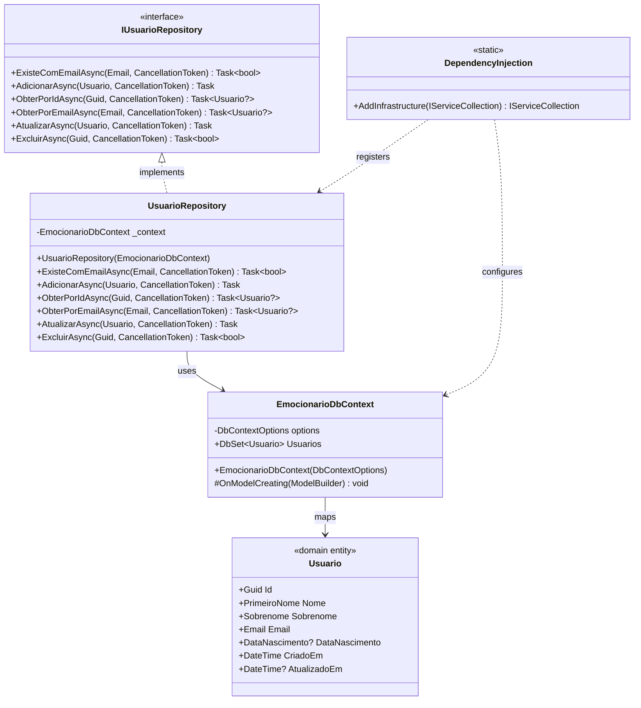

# Emocionario.Infrastructure

Camada de infraestrutura do projeto Emocionario, responsável pela implementação de acesso a dados, persistência e integração com tecnologias externas.

## Diagrama de Classe



## Estrutura da Infraestrutura

### Data

#### EmocionarioDbContext
Contexto do Entity Framework Core que gerencia as entidades e configurações do banco de dados.

**Localização:** [EmocionarioDbContext.cs](Data/EmocionarioDbContext.cs)

**Responsabilidades:**
- Gerenciar conexão com banco de dados
- Configurar mapeamento de entidades para tabelas
- Configurar conversões de Value Objects
- Definir índices e constraints
- Prover DbSets para acesso às entidades

**Configurações:**
- **Usuario**: Mapeamento completo com conversões de Value Objects
  - `Nome`: Conversão de PrimeiroNome para string (max 100 caracteres)
  - `Sobrenome`: Conversão de Sobrenome para string (max 100 caracteres)
  - `Email`: Conversão de Email para string (max 255 caracteres) com índice único
  - `DataNascimento`: Conversão de DataNascimento para DateOnly nullable
  - `CriadoEm`: Campo obrigatório de auditoria
  - `AtualizadoEm`: Campo opcional de auditoria

**Banco de Dados:**
- Atualmente configurado com InMemory Database para desenvolvimento
- Nome do banco: "EmocionarioDB"

### Repositories

#### UsuarioRepository
Implementação concreta do repositório de usuários usando Entity Framework Core.

**Localização:** [UsuarioRepository.cs](Repositories/UsuarioRepository.cs)

**Responsabilidades:**
- Executar operações CRUD no banco de dados
- Gerenciar transações e persistência
- Implementar queries usando LINQ e Entity Framework
- Garantir atomicidade das operações com SaveChangesAsync

**Dependências:**
- `EmocionarioDbContext`: Para acesso ao banco de dados

**Operações:**

**`ExisteComEmailAsync()`**
- Verifica se existe usuário com o email informado
- Usa `AnyAsync()` para performance otimizada
- Retorna booleano indicando existência

**`AdicionarAsync()`**
- Adiciona novo usuário ao contexto
- Persiste mudanças com `SaveChangesAsync()`
- Operação atômica

**`ObterPorIdAsync()`**
- Busca usuário por Id usando `FirstOrDefaultAsync()`
- Retorna null se não encontrado
- Query otimizada sem tracking desnecessário

**`ObterPorEmailAsync()`**
- Busca usuário por Email usando `FirstOrDefaultAsync()`
- Utiliza comparação direta de Value Object
- Retorna null se não encontrado

**`AtualizarAsync()`**
- Marca entidade como modificada com `Update()`
- Persiste mudanças com `SaveChangesAsync()`
- Entity Framework detecta mudanças automaticamente

**`ExcluirAsync()`**
- Busca usuário antes de excluir
- Retorna false se não existir
- Remove do contexto e persiste
- Retorna true se exclusão bem-sucedida

### Dependency Injection

#### DependencyInjection
Classe estática de extensão para configurar serviços da camada Infrastructure.

**Localização:** [DependencyInjection.cs](DependencyInjection.cs)

**Método:**
```csharp
public static IServiceCollection AddInfrastructure(this IServiceCollection services)
```

**Configurações Registradas:**
1. **DbContext**:
   - Configurado com InMemory Database
   - Lifetime: Scoped
   - Nome: "EmocionarioDB"

2. **Repositories**:
   - `IUsuarioRepository` → `UsuarioRepository`
   - Lifetime: Scoped

**Uso:**
```csharp
services.AddInfrastructure();
```

## Tabela de Testes

### Testes de Repository

| Cenário de Teste | Entrada | Resultado Esperado | Prioridade |
|------------------|---------|-------------------|------------|
| **ExisteComEmailAsync** | | | |
| Verificar email existente | Email cadastrado | true retornado | Alta |
| Verificar email não existente | Email não cadastrado | false retornado | Alta |
| Verificar com email inválido | Email mal formatado | Comparação usando Value Object | Média |
| Verificar case sensitivity | Emails com cases diferentes | Comportamento consistente | Média |
| Múltiplas verificações | Mesmo email várias vezes | Resultados consistentes | Baixa |
| **AdicionarAsync** | | | |
| Adicionar usuário válido | Usuario completo | Usuário persistido com sucesso | Alta |
| Adicionar com email duplicado | Email já existente | DbUpdateException por constraint | Alta |
| Adicionar e verificar Id | Usuario novo | Id gerado automaticamente | Alta |
| Adicionar e verificar timestamps | Usuario novo | CriadoEm preenchido | Média |
| Adicionar sem DataNascimento | DataNascimento null | Persistido corretamente | Média |
| Cancelamento durante adição | CancellationToken cancelado | OperationCanceledException | Baixa |
| **ObterPorIdAsync** | | | |
| Obter usuário existente | Id válido existente | Usuario completo retornado | Alta |
| Obter usuário inexistente | Id válido não existente | null retornado | Alta |
| Obter com Guid.Empty | Guid.Empty | null retornado | Média |
| Verificar Value Objects | Id existente | Propriedades convertidas corretamente | Alta |
| Verificar relacionamentos | Id com relacionamentos | Entidades relacionadas carregadas | Baixa |
| **ObterPorEmailAsync** | | | |
| Obter por email existente | Email válido existente | Usuario completo retornado | Alta |
| Obter por email inexistente | Email válido não existente | null retornado | Alta |
| Verificar comparação de Email | Email como Value Object | Comparação funciona corretamente | Alta |
| Case sensitivity na busca | Emails com cases diferentes | Comportamento definido | Média |
| **AtualizarAsync** | | | |
| Atualizar campos simples | Usuario modificado | Alterações persistidas | Alta |
| Atualizar Value Objects | Nome/Email alterados | Conversões aplicadas corretamente | Alta |
| Atualizar sem mudanças | Usuario sem alterações | Nenhum erro, operação idempotente | Média |
| Atualizar AtualizadoEm | Campo timestamp | Atualizado automaticamente | Média |
| Atualizar entidade desanexada | Usuario de outra sessão | Update anexa e persiste | Média |
| Concorrência | Duas atualizações simultâneas | Última escrita vence ou erro | Baixa |
| **ExcluirAsync** | | | |
| Excluir usuário existente | Id válido existente | true retornado, registro removido | Alta |
| Excluir usuário inexistente | Id válido não existente | false retornado | Alta |
| Excluir e verificar persistência | Id existente | Registro não existe após exclusão | Alta |
| Excluir com relacionamentos | Usuario com dependências | Comportamento definido por cascata | Média |
| Exclusão idempotente | Mesmo Id duas vezes | Segunda retorna false | Média |

### Testes de DbContext

| Cenário de Teste | Descrição | Resultado Esperado | Prioridade |
|------------------|-----------|-------------------|------------|
| **Configurações de Entidade** | | | |
| Conversão de PrimeiroNome | Salvar e recuperar | Conversão bidirecional funciona | Alta |
| Conversão de Sobrenome | Salvar e recuperar | Conversão bidirecional funciona | Alta |
| Conversão de Email | Salvar e recuperar | Conversão bidirecional funciona | Alta |
| Conversão de DataNascimento | Salvar e recuperar DateOnly | Conversão bidirecional funciona | Alta |
| DataNascimento null | Salvar com valor null | Persiste e recupera null | Alta |
| Constraint de Email único | Inserir emails duplicados | DbUpdateException lançada | Alta |
| MaxLength de campos | Valores acima do limite | Truncado ou erro | Média |
| Campos obrigatórios | Inserir com campos null | Erro de validação | Média |
| **Comportamento do Contexto** | | | |
| Tracking de entidades | Modificar entidade rastreada | Mudanças detectadas automaticamente | Média |
| No-tracking queries | AsNoTracking() | Performance melhorada, sem rastreamento | Baixa |
| Múltiplas operações | SaveChanges com múltiplas mudanças | Todas persistidas atomicamente | Média |
| Rollback em erro | Erro durante SaveChanges | Nenhuma mudança persistida | Média |

### Testes de Integração

| Cenário de Teste | Descrição | Resultado Esperado | Prioridade |
|------------------|-----------|-------------------|------------|
| Setup de DependencyInjection | AddInfrastructure() | Todos serviços registrados | Alta |
| Resolução de IUsuarioRepository | ServiceProvider.GetService() | UsuarioRepository retornado | Alta |
| Resolução de DbContext | ServiceProvider.GetService() | EmocionarioDbContext retornado | Alta |
| Lifetime Scoped | Múltiplas resoluções no scope | Mesma instância retornada | Média |
| Lifetime entre Scopes | Resoluções em scopes diferentes | Instâncias diferentes | Média |
| Ciclo CRUD completo | Criar → Obter → Atualizar → Excluir | Todas operações com persistência | Alta |
| Transações | Múltiplas operações em sequência | Atomicidade garantida | Média |
| Isolamento de dados | Operações em scopes paralelos | Isolamento correto | Baixa |

## Princípios de Design Aplicados

### Clean Architecture
- **Infrastructure Layer:** Implementação de detalhes técnicos
- **Dependency Inversion:** Implementa interfaces da camada Application
- **Isolamento:** Camadas superiores não dependem de Infrastructure
- **Abstrações:** Repository Pattern abstrai persistência

### SOLID
- **Single Responsibility:**
  - DbContext: Configuração e mapeamento
  - Repository: Acesso a dados
  - DependencyInjection: Configuração de serviços
- **Open/Closed:** Extensível via configuration e providers
- **Liskov Substitution:** UsuarioRepository substituível via interface
- **Interface Segregation:** Implementa apenas IUsuarioRepository
- **Dependency Inversion:** Depende de abstrações (DbContext, interfaces)

### Outros Padrões
- **Repository Pattern:** Abstração de acesso a dados
- **Unit of Work:** DbContext gerencia transações
- **Dependency Injection:** Configuration via Extension Method
- **Value Object Conversion:** Mapeamento bidirecional automático
- **InMemory Database:** Desenvolvimento e testes rápidos
- **Async/Await:** Todas operações de I/O assíncronas
- **CancellationToken:** Suporte a cancelamento em todas operações

## Conversões de Value Objects

O Entity Framework Core está configurado para converter automaticamente os Value Objects do domínio para tipos primitivos no banco de dados:

| Value Object | Tipo no Banco | Conversão |
|--------------|---------------|-----------|
| PrimeiroNome | string(100) | `.Valor` → string / string → `new PrimeiroNome()` |
| Sobrenome | string(100) | `.Valor` → string / string → `new Sobrenome()` |
| Email | string(255) | `.Valor` → string / string → `new Email()` |
| DataNascimento? | DateOnly? | `.Value.Valor` → DateOnly? / DateOnly? → `new DataNascimento()` |

**Benefícios:**
- Transparência: Entidades de domínio mantêm Value Objects
- Validação: Reconstrução automática valida dados do banco
- Performance: Conversões otimizadas pelo EF Core
- Type Safety: Compilador garante uso correto

## Configuração de Banco de Dados

### Atual: InMemory Database
```csharp
services.AddDbContext<EmocionarioDbContext>(options =>
    options.UseInMemoryDatabase("EmocionarioDB"));
```

**Características:**
- Rápido e leve para desenvolvimento
- Dados perdidos ao reiniciar aplicação
- Sem necessidade de migrations
- Ideal para testes unitários e integração

### Migração para SQL Server (Futuro)
```csharp
services.AddDbContext<EmocionarioDbContext>(options =>
    options.UseSqlServer(connectionString));
```

**Passos necessários:**
1. Adicionar package `Microsoft.EntityFrameworkCore.SqlServer`
2. Configurar connection string
3. Criar migrations: `dotnet ef migrations add InitialCreate`
4. Aplicar ao banco: `dotnet ef database update`

### Migração para PostgreSQL (Futuro)
```csharp
services.AddDbContext<EmocionarioDbContext>(options =>
    options.UseNpgsql(connectionString));
```

## Constraints e Índices

### Usuários
- **Primary Key:** `Id` (Guid)
- **Unique Index:** `Email` (garante unicidade)
- **Required:** `Nome`, `Sobrenome`, `Email`, `CriadoEm`
- **Optional:** `DataNascimento`, `AtualizadoEm`

## Convenções de Código

- **Namespace:** `Emocionario.Infrastructure.{Subpasta}`
- **Repositories:** Classes públicas implementando interfaces da Application
- **DbContext:** Configurações no método `OnModelCreating()`
- **Conversions:** Definidas inline no ModelBuilder
- **DependencyInjection:** Extension method `AddInfrastructure()`
- **Async/Await:** Todos métodos de I/O são assíncronos
- **CancellationToken:** Propagado para todos métodos do EF Core
- **Nullable Reference Types:** Habilitados para maior segurança

## Dependências

### Packages NuGet
- **Microsoft.EntityFrameworkCore.InMemory** (9.0.0): Provider InMemory
- **Microsoft.Extensions.DependencyInjection.Abstractions** (10.0.1): Injeção de dependência

### Referências de Projeto
- **Emocionario.Domain**: Entidades e Value Objects
- **Emocionario.Application**: Interfaces de repositórios

## Boas Práticas

### Performance
- Use `AsNoTracking()` para queries read-only
- Implemente paginação para grandes datasets
- Use índices para campos de busca frequente
- Evite N+1 queries com `.Include()`

### Segurança
- Sempre use parâmetros (EF Core faz automaticamente)
- Valide dados antes de persistir (feito no Domain)
- Use transações para operações múltiplas
- Nunca exponha detalhes de infraestrutura

### Manutenibilidade
- Mantenha configurações no OnModelCreating
- Separe repositories por agregado
- Use migrations para controle de versão do schema
- Documente conversões complexas

### Testes
- Use InMemory para testes unitários de repositories
- Use TestContainers para testes de integração realistas
- Teste conversões de Value Objects explicitamente
- Verifique comportamento de constraints e índices
